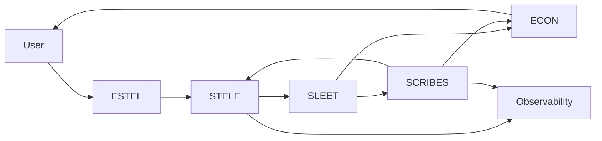
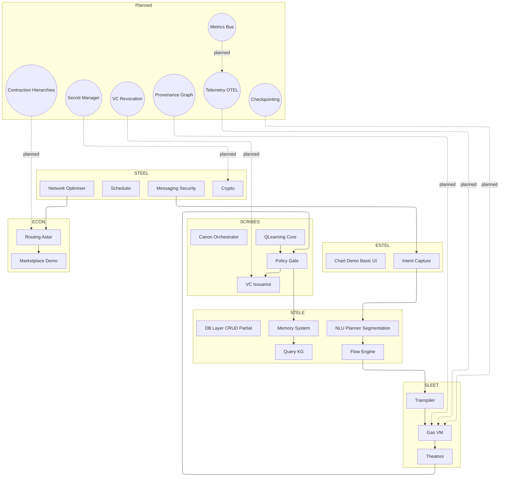
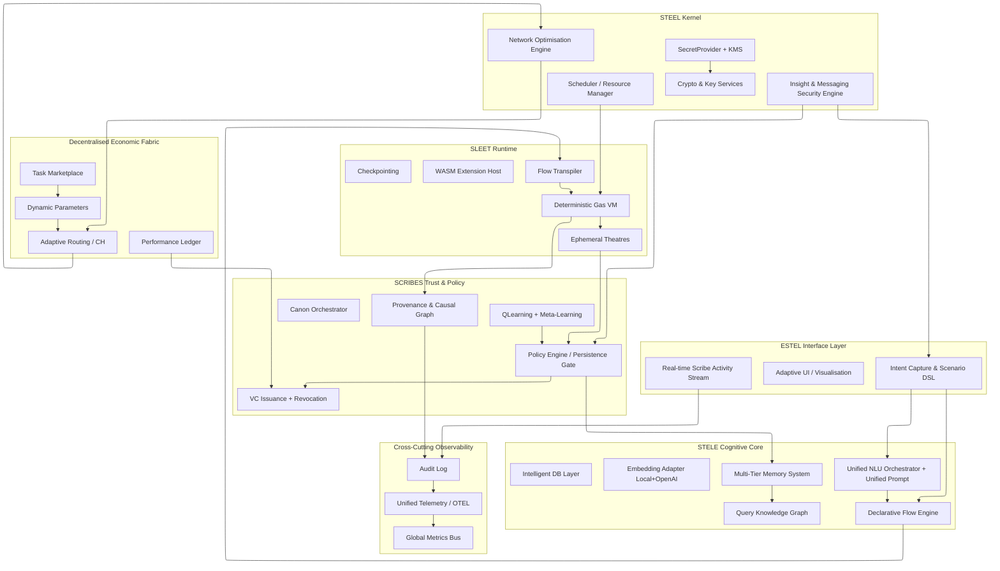

Copyright (C) 2024 Jonathan Lee.

# A Sovereign, Decentralised Cognitive Architecture

## A Technical Paper & Vision Document

**Version 1.0 – 9 August 2025**

## Executive Summary

This document sets out the Thinking System: a sovereign, decentralised cognitive architecture designed to shift computational intelligence away from centralised utilities and towards user‑owned execution. The stakes are immediate. Model and compute centralisation is hardening into critical infrastructure, concentrating decision‑making, failure modes, and economic rents. Absent a countervailing architecture, the next decade will lock in path dependencies that are costly to reverse and difficult to regulate. The response here is a vertically integrated stack that isolates ephemeral reasoning (Agents in sandboxed theatres) from trusted persistence (Scribes enforcing signed policy bundles), couples adaptive learning to provenance, and embeds an economic fabric for decentralised resource exchange.

What runs today: deterministic gas‑metered virtual machine (SLEET), adaptive Cranelift‑backed JIT with hybrid FFI execution path, flow transpilation pipeline, multi‑tier neuro‑symbolic memory with auto‑generated knowledge graph, adaptive NLU planner, WASM dynamic executor for STELE flows (Wasmtime), hybrid messaging security engine (heuristics + local NER), reinforcement‑driven Scribe layer, verifiable credential issuance demo, network optimisation prototype, and economic fabric feedback loop (performance → credential → incentive adjustment). Core invariants (execution determinism, capability scoping, auditable persistence mediation) are enforced end‑to‑end across demos.

Safety & governance: persistence is mediated asynchronously through policy‑versioned Scribes; dynamic backpressure derives distribution‑aware thresholds (no static magic numbers); policies evolve via draft → staging → shadow → activation with multi‑signature and differential metrics gating; adaptive parameters are enveloped by guardrails and provenance anchoring. Insight and messaging security uses percentile adaptive thresholds, on‑device processing, and feedback learning loops.

Why this matters: it lowers the activation energy for sovereign AI adoption (local control, verifiable behaviours), creates a substrate for permissionless extension (declarative flows, WASM, policy bundles), and establishes economic portability of trust (credentials as externalisable performance attestations). Near‑term milestones accelerate verifiability (provenance graph), resilience (checkpointing), adaptive optimisation (dynamic backpressure control), and observability (unified telemetry + metrics bus). Contributor entry points are explicitly mapped to gap IDs for rapid onboarding.

Next 5 milestones (gap linkage): PV-01 Provenance Graph, BP-01 Backpressure Control Layer, GOV-01 Shadow Policy Mode, OBS-01/02 Unified Telemetry + Metrics Bus, RT-01 Checkpointing.

---

## 1. Introduction

### 1.1 Abstract

The central question of the 21st century revolves around the topology of artificial intelligence. Centralised utility—convenient systems are poised to dominate, governed by consolidating power structures. This paper outlines a more distributed cognitive fabric, owned and directed by everyone who uses it. This paper presents a working architecture for the latter scenario, designed to be deployed incrementally today. The goal is pragmatic sovereignty: verifiable behaviours, explicit trust boundaries, and a path away from single‑vendor dependence without sacrificing capability.

The prevailing paradigm of centralised, cloud-hosted AI presents challenges to user sovereignty, data integrity, and equitable access to computational resources. This paper introduces the Thinking System, a sovereign, decentralised cognitive architecture designed to address these challenges. It proposes a model for artificial intelligence that is user-owned, secure by design, and architected for close human-computer interaction.

This paper presents a vertically integrated, copyleft software stack encompassing a dedicated agent runtime, a structured memory engine, and a Byzantine-fault tolerant economic layer. This system is designed as a public good utility to facilitate a secure, resilient, and more equitable distribution of cognitive and computational power.

### 1.2 The Crisis of Centralised AI

Current digital infrastructure models often centralise data and compute resources, leading to an increasingly brittle and asymmetric ecosystem. Breaches and outages propagate widely; user agency is constrained; capability and capital accrue to a handful of platforms. This concentration creates gravity wells that shape innovation and risk management, effectively establishing a permissioned posture on what should be a public frontier. The window for course‑correction is narrowing as network effects compound and interfaces ossify.

An alternative model is required. Digital infrastructure can be re‑architected to be inherently secure, decentralised, and aligned with the interests of its users. The Thinking System outlines such a path by privileging user custody, verifiable operation, and modular trust boundaries over platform lock‑in.

### 1.3 The Vision: A Sovereign Cognitive Fabric

The system is envisioned as ambient, personal, and sovereign. A Thinking System resides with each user, acting as a fiduciary agent—a cognitive tool that enhances memory, abstracts away complexity, and serves as a trusted conduit to the digital and physical worlds.

This is not a standalone application, but a node in a global, peer-to-peer fabric that enables:

- **Data Sovereignty:** Users retain absolute custody of their data; default is least‑privilege, auditable access.
- **Public Compute Utility:** Idle capacity contributes to a decentralised pool, flattening access asymmetries.
- **Human–AI Symbiosis:** Always‑on co‑operation: the human supplies grounded context; the system supplies structured recall and reasoning.

### 1.4 Guiding Principles

The architecture is guided by five core principles:

- **Sovereignty:** The system maintains autonomy over its processes and data, acting solely for the user's benefit.
- **Emergence:** Complex, intelligent behaviour arises from the interaction of simple, well-defined components.
- **Adaptability:** The system continuously learns and evolves from experience to improve its utility.
- **Transparency:** All cognitive processes are introspectable and auditable. Trust is built on verifiable proof.
- **Modularity:** Components are loosely coupled and independently verifiable, allowing for robust and resilient systems.

### 1.5 Implementation Status and Roadmap

The architecture described here is already exercised through working vertical slices, substantiating the separation between ephemeral agency and guarded persistence. The diagrams below provide a transparent overview of the current operational state and the planned work, which corresponds to the near-term priorities listed. In keeping with the project's principle of verifiable transparency, the parenthetical implementation notes throughout this document were generated by an LLM-driven pipeline that reviews the source code to create a direct, auditable link between the described architecture and its concrete implementation.

#### Implementation Claim → Evidence Snapshot

| Claim                                  | Evidence (Repo / Demo)                                                                                               | Status       |
| -------------------------------------- | -------------------------------------------------------------------------------------------------------------------- | ------------ |
| Deterministic, gas‑metered execution   | `crates/sleet/src/vm/` gas accounting; `crates/sleet/src/orchestration/flow_scheduler.rs` concurrency & limits       | Implemented  |
| Flow transpilation pipeline            | `crates/sleet/src/transpiler.rs` (two‑pass compiler, static checks)                                                  | Implemented  |
| Policy‑mediated persistence            | `crates/stele/src/lib.rs` (scribes, DatabaseMetrics); `crates/stele/src/graphs/models/scribe.rs`                     | Implemented  |
| Neuro‑symbolic memory & KG             | `crates/stele/src/database/query_kg.rs`                                                                              | Implemented  |
| Adaptive NLU planning                  | `crates/stele/src/nlu/orchestrator/mod.rs` (policy/capability matching); `docs/nlu/detail/NLUOrchestrator.md`        | Implemented  |
| Messaging security (hybrid)            | `crates/steel/src/messaging/insight/ner_analysis.rs`; `bin/demos/telegram-messaging-demo/`                           | Implemented  |
| Adaptive JIT + Hybrid FFI execution    | `crates/sleet/src/runtime/jit/**`, `crates/sleet/src/runtime/vm.rs` (hybrid JIT/FFI, profiler, cache)                | Implemented  |
| WASM extension host (STELE flows)      | `crates/stele/src/flows/dynamic_executor/{assembly.rs,executor.rs}`; tests in `crates/stele/tests/assembly_tests.rs` | Implemented  |
| Network optimisation prototype         | `bin/gtr-fabric/` (Elixir fabric, routing/marketplace demos)                                                         | Prototype    |
| Orchestration metrics/audit            | `crates/sleet/src/orchestration/event_system.rs` (`MetricsEventHandler`, event bus)                                  | Implemented  |
| Dynamic backpressure (adaptive design) | Appendix A (BP-01..03)                                                                                               | Planned      |
| Provenance graph                       | PV-01                                                                                                                | Planned      |
| Unified telemetry / metrics            | OBS-01 / OBS-02                                                                                                      | Planned      |
| Checkpointing                          | RT-01 (`StateCheckpoint` blocks; `crates/sleet/src/orchestration/{flow_scheduler.rs,session_manager.rs}` active)     | Experimental |

#### Metrics Snapshot (illustrative; auto‑generation planned)

- Demos: ≥ 10 vertical slices (runtime, orchestration, messaging, economic, data profiling)
- Core Rust crates: STEEL, STELE, SLEET, SCRIBES, ESTEL, ECON components
- Reinforcement modules: QLearningCore + MetaLearningController (adaptive ratios)
- Credential pathways: issuance + revocation scaffold (revocation pending)

#### Simplified High-Level Architecture

Full operational and target diagrams follow.

### Figure 1: Current Operational Architecture & Planned Components

Legend: Solid nodes = implemented; nodes in GAPS cluster = not yet implemented; dashed edges denote planned integrations.

Note: A Wasmtime‑backed WASM executor is implemented today within STELE’s dynamic executor for flow blocks; integration as a first‑class SLEET extension host remains a target design.

Gap References: CH (CH-01), Provenance (PV-01), Telemetry (OBS-01), Metrics Bus (OBS-02), Checkpointing (RT-01), VC Revocation (VC-REV-01), Secret Manager (SEC-01), Unified Prompt (NLU-UNI-01), Performance Ledger (PERF-LED-01).

### Figure 2: Target System Architecture (Full)

Key planned components not yet fully implemented: Provenance graph, unified telemetry/metrics bus, checkpointing, Contraction Hierarchies acceleration, secret manager & revocation registry, unified prompt consolidation, performance ledger integration, global real-time visualisation, marketplace–routing coupling to health model.
Current status clarifications: JIT and hybrid FFI are implemented in SLEET; a WASM execution path exists in STELE’s dynamic executor. Checkpointing is experimental (session checkpoint APIs and orchestration hooks present; deterministic replay harness maturing).

### Contributor Entry Points (Gaps to Adopt)

- PV-01 Provenance Graph: design graph schema + ingestion hooks from VM and Policy decisions.
- BP-01 Backpressure Control Layer: implement CommitQueue metrics + FlowControlSignal emitter.
- GOV-01 Shadow Policy Mode: execution path for parallel advise‑only evaluation + differential metrics capture.
- OBS-01/02 Telemetry + Metrics Bus: OpenTelemetry integration + unified metrics registry.
- RT-01 Checkpointing: serialisable theatre state snapshots + deterministic replay harness.

## 2. Architectural Overview

This section consolidates the project’s high‑level architecture descriptions.

The Thinking System is a full‑stack implementation comprising six core components and one cross‑cutting concern (Observability). The target architecture illustrates the intended state of the fully integrated system, emphasising provenance, adaptive optimisation, and tight economic and security coupling across layers.

### 2.1. The Foundational Layers

- STEEL (Kernel): Resource management, scheduling, cryptographic/key services, and core system facilities; it provides a stable substrate for the stack.
- STELE (Cognitive Core): Memory, learning, and analysis; AI-powered query over a structured knowledge graph with an intelligent DB layer.
- SLEET (Agent Runtime): Deterministic, gas‑metered bytecode VM with ephemeral, capability‑scoped theatres and WASM extension host.
- SCRIBES (Trust & Policy): Persistent guardians mediating policy‑enforced persistence, provenance capture, and verifiable credential workflows. Note: SCRIBES is a logical layer implemented across STELE modules today; a standalone crate may be introduced as the policy engine expands.
- ESTEL (Human–AI Interface): Intent capture, adaptive UI/visualisation, and bidirectional data transformation.
- ECON (Economic Fabric): Marketplace, adaptive routing, dynamic pricing, and performance ledger for decentralised compute exchange.

Observability (cross‑cutting): Unified telemetry, metrics bus, and audit logging across all layers.

### 2.2. The Agent–Scribe Dichotomy

Agents are untrusted, task‑specific workers that execute inside SLEET theatres. They cannot directly write to long‑term memory; they may only request persistence.

Scribes are trusted, long‑lived mediators over STELE. They evaluate persistence requests against programmable policies (source verification, coherence with existing knowledge, user rules). Only validated requests are committed. This separation enables an open ecosystem of agents without compromising core integrity.

### 2.3. System Flow: From Intent to Action

1. Intent capture (ESTEL): User expresses a goal.
2. Flow invocation (STEEL & STELE): ESTEL formalises the request; STEEL schedules; STELE resolves relevant context.
3. Agent execution (SLEET): A theatre is created; an Agent runs a suitable Flow; data streams into the sandbox.
4. Reasoning: The Agent computes outputs.
5. Persistence request: The Agent requests that findings be committed; the theatre is destroyed.
6. Policy enforcement (SCRIBES): A Scribe validates the request against policy and quality checks.
7. Memory commit (STELE): On success, knowledge is written and linked to sources.
8. Response (ESTEL): Results are returned to the user with links to the committed artefacts.

### 2.4. Threat Model

Scope: execution (SLEET theatres), persistence (STELE via SCRIBES), interface (ESTEL), and economic fabric (ECON).

Controls (currently implemented):

- Deterministic, capability‑scoped execution: gas‑metered bytecode VM and capability matching in SLEET (`crates/sleet/README.md`, gas VM; `crates/sleet/src/orchestration/adapters/agent_adapter.rs` required_capabilities; `crates/sleet/src/transpiler.rs` static analysis errors preventing unsafe patterns).
- Sandboxed theatres and scheduling: ephemeral execution contexts with scheduler constraints (`crates/sleet/src/orchestration/flow_scheduler.rs`, concurrency limits; `StateCheckpoint` scaffolding for safe replay).
- Policy‑mediated persistence: Scribes as the only write path to memory (`crates/stele/src/lib.rs` exposing `scribes` and `DatabaseMetrics`; Scribe graph models in `crates/stele/src/graphs/models/scribe.rs`).
- Model and provider selection policy: NLU orchestrator with capability‑based selection and policy matching (`crates/stele/src/nlu/orchestrator/mod.rs`, `policy_matches`, capability checks; `models_v2.yml` capability profiles and metrics).
- Messaging/insight security: local NER + heuristics, adaptive thresholds (Appendix B; GLiNER ONNX model in `models/gliner-x-small`, demo in `bin/demos/telegram-messaging-demo`).
- Metrics and audit hooks: orchestration event bus and metrics aggregation (`crates/sleet/src/orchestration/event_system.rs`, `MetricsEventHandler`), database metrics interfaces in STELE.
- Credentials and revocation scaffolding: VC issuance demos (SCRIBES/ECON; revocation listed as planned with gap `VC-REV-01`).

Primary risks and mitigations:

- Prompt/model supply risks: mitigated via capability‑based selection and performance metrics learning (models_v2), plus planned multi‑provider fallback (near‑term priorities 6).
- Data poisoning via agent outputs: mitigated by policy‑gated persistence and provenance anchoring (Appendix A; planned provenance graph PV‑01).
- Execution DoS via persistence spam: mitigated by backpressure signals, token buckets, coalescing, and priority demotion (Appendix A BP‑01..03).
- Replay/rollback inconsistencies: addressed by planned checkpointing and deterministic replay harness (RT‑01) with scheduler constraints.
- Key/secret exposure: secret manager/KMS integration planned (SEC‑01) and cryptographic services in STEEL (`Crypto & Key Services`).

Generally:

- Theatres are treated as untrusted; only Scribes can commit durable state.
- External providers are treated as semi‑trusted; capability profiles and metrics bound exposure.

## 3. Use Cases and Applications

3.1. The Sovereign Personal Assistant
A Thinking System node on personal hardware can function as a truly private assistant, managing schedules, finances, and health records with the guarantee that the user's data remains under their exclusive control.

3.2. The Enterprise "Nervous System"
For enterprises, the architecture offers a solution to data silos. Each department deploys a Scribe programmed with its specific data governance policies. Agents from other departments can then request aggregate insights without ever accessing the raw, underlying data, enabling secure cross-functional collaboration.

3.3. A Platform for Permissionless Innovation
The ECON public compute utility creates a decentralised platform for scientific and commercial innovation, lowering the cost of AI research and freeing developers from vendor lock-in.

## 4. Philosophy and Conclusion

The Thinking System is more than software; it is an architectural philosophy for a more federated and equitable digital ecosystem. Its governance is not top-down but an emergent property of its layers: procedural governance from the Scriptorium, economic governance from the Economic Fabric, and ultimate self-governance for the individual.

The foundation has been laid, and the viability of the core principles explored. The choice is between a world where intelligence is a utility controlled by a few, and one where it is a faculty possessed by all. This architecture is built for the latter. We invite developers, researchers, and designers to join in this endeavour.

## Near‑term priorities (complementary to milestones)

1. Provenance surfacing: first‑class per‑flow execution metrics and causal graphs linking agent actions, memory writes, and credential issuance.
2. Verifiable performance credentials: live integration of execution counters into credential `perf_map` plus an explicit revocation registry.
3. Unified linguistic pipeline: consolidation of segmented prompt stages into a single adaptive pass with pluggable embedding backends.
4. Deterministic seed unification: one canonical entropy source across VM scheduling, sampling, and trust drift simulation.
5. Flow language formalisation: publish minimal grammar + reference spec supporting third‑party tooling and static analysis.
6. Resilient model orchestration: multi‑provider fallback and bounded caching layer honouring cost / latency / policy constraints.
7. Persistent checkpointing: activate and persist theatre / flow checkpoints for reproducible replays under failure scenarios.
8. Automated governance scaffolding: generation of a public status matrix and curated entry issues directly from gap metadata.

## Appendices: Technical Deep Dives

### Appendix A: Flow Control & Policy Governance

This appendix defines how slower, deliberative trust components (SCRIBES) safely regulate faster upstream execution (SLEET) and how policies themselves are versioned, validated, and evolved without introducing systemic risk.

A.1. Asynchronous Persistence Intent Pipeline
Lifecycle:

A running theatre emits a PersistenceIntent { flow_id, theatre_id, payload_hash, size, priority, causal_links[] } instead of performing a blocking call.

The intent enters a bounded, multi-queue CommitQueue (global + per-tenant shards) implemented as lock-free ring buffers with backpressure metrics.

The Policy Engine (SCRIBES) consumes intents, performs validation (semantic diff, provenance checks, policy rule evaluation), and on success emits a signed CommitReceipt → Memory subsystem.

The theatre proceeds optimistically (it does not block); downstream flows that depend on the committed state await the CommitReceipt via an event bus (or degrade to local ephemeral cache if delayed).

A.2. Backpressure Signalling Model
The Policy Engine publishes a periodic FlowControlSignal computed from rolling EWMAs. Instead of fixed thresholds, it uses a policy-driven, adaptive model to derive dynamic state boundaries (Green, Amber, Red) based on the observed distribution of a composite backpressure metric `B`. A lightweight RL loop can optionally tune weights and the target distribution to optimise a reward that balances throughput against penalties for SLA violations and errors.

Composite metric and variables (derived each control interval):

- `depth_ratio = queue_depth / queue_capacity`
- `latency_ratio = p95_validation_latency / p95_sla`
- `error_ratio = validation_failures / processed_intents_window`
- `B = w_d * depth_ratio + w_l * latency_ratio + w_e * error_ratio`

Dynamic boundary derivation (policy‑driven, statistically grounded):

- Maintain a rolling window `W` of `B` and raw ratios; compute robust location/dispersion (median, MAD) and empirical quantiles.
- Derive provisional cut points: `green_upper = Q(T.green)`, `amber_upper = Q(T.green + T.amber)`; red otherwise.
- Apply exponential smoothing to cut points: `new_cut = old_cut * (1 - β) + provisional * β`, with guardrails and monotonic enforcement.
- Hysteresis: enter/exit offsets per state prevent oscillation.

State labels at runtime:

- Green: `B ≤ green_upper`
- Amber: `green_upper < B ≤ amber_upper`
- Red: `B > amber_upper`

A.3. Upstream Throttling Mechanisms
Token Bucket Credits: Each theatre has a `persistence_token_bucket` (capacity `C`, refill rate `R`). On Red, shrink `C` and reduce `R` (e.g., ×0.25); on Amber, moderate reduction (e.g., ×0.6). Ensure a hard floor (at least one token per interval) for critical commits.

Instruction‑Level Yield: The VM can inject a `YIELD_BACKPRESSURE` opcode to cooperatively pause intent‑heavy flows before the next intent‑producing block.

Intent Coalescing & Dedup: Multiple identical payload hashes within a short window `Δ` merge into one intent with a subscriber list, reducing redundant validations.

Priority Demotion: Non‑critical intents may be deferred to lower‑priority queue slices when Amber/Red.

Adaptive Concurrency: The global scheduler lowers max concurrent theatres allocated to intent‑heavy flows as `B` rises.

A.4. Policy Artefact Lifecycle & Governance
Policies are versioned, signed bundles (PolicyBundle) that progress through a safe, multi-stage lifecycle:

Draft: Authored and validated locally with static analysis.

Staging: Deployed to a staging namespace to test against recorded production workloads.

Shadow (Advise-Only): Runs in parallel with the active policy in production, recording advice decisions for analysis without enforcement.

Activation: Requires M-of-N multi-signature approval and can be subject to a time lock for final review.

Adaptive Phase: Autonomously tunes designated tunable parameters within pre-defined safety bounds.

Retirement / Rollback: Can be triggered manually or automatically if key guardrail metrics are breached.

This governable flow-control ensures high-throughput agent reasoning remains safe under variable trust evaluation latency, while enabling continuous, auditable policy evolution.

A.5. Guardrails & Safety Nets

- Static analysis: Policy DSL forbids unbounded recursion/loops; evaluation is pure; side‑effects only via declared interfaces.
- Differential metrics: Shadow mode collects confusion‑matrix deltas vs active; promotion gated by precision/recall thresholds.
- Provenance anchoring: Each decision records `(policy_version, rules_fired[], validation_duration, intent_hash, outcome, signer_ids[])` for forensic rewind and regression tests.
- Parameter change ledger: Adaptive parameter mutations are appended to an append‑only log and cross‑checked against decision shifts.
- Simulation harness: Synthetic workload generator replays burst/adversarial scenarios before activation.
- Multi‑sig & time‑lock: Activation requires quorum and emits a `pending_active_at` timestamp (grace window), except emergencies.

A.6. Failure & Degradation Modes

- Policy Engine unavailable: Route intents to `quarantine_queue`; only whitelisted critical commits processed via minimal fallback rules.
- Sustained Red backpressure: Pause new intent‑heavy flows; allow compute to finish; discard non‑critical persistence intents (auditable as discarded); notify via ESTEL.
- Policy regression detected: Automatic rollback; candidate reverts to shadow; alert emitted.

A.7. Metrics & Observability

Expose counters/gauges (mapped to OBS‑01 / OBS‑02): `commit_queue_depth`, `commit_queue_latency_p95`, `policy_validation_latency_avg/p95`, `backpressure_level` (0/1/2), `policy_shadow_false_positive_delta/false_negative_delta`, `adaptive_param_change_rate`, `rollback_events_total`, `dynamic_green_upper`, `dynamic_amber_upper`, `backpressure_reward`.

A.8. New Gap IDs

Introduces: BP‑01 (Backpressure Control Layer), BP‑02 (Intent Coalescing & Dedup), BP‑03 (Dynamic Policy‑Driven Threshold Optimisation), GOV‑01 (Policy Versioning & Shadow Mode), GOV‑02 (Multi‑Signer Activation & Time Lock), GOV‑03 (Simulation & Replay Harness), GOV‑04 (Adaptive Parameter Guardrails), GOV‑05 (Policy Differential Metrics Automation).

### Appendix B: STEEL Kernel & Insight Engine

B.1. STEEL: The Kernel and Resource Manager
STEEL is the bedrock of the system. Written entirely in Rust, its primary responsibilities are:

Resource Management: Exclusive control over physical resources like CPU, memory, and storage I/O.

Process Scheduling: Manages the execution of all system tasks, from long-running Scribes to ephemeral SLEET theatres.

Inter-Process Communication (IPC): Provides a secure, high-performance messaging bus between layers.

Cryptographic Primitives: Provides low-level, hardware-accelerated cryptographic functions.

B.2. Insight & Messaging Security Engine
The STEEL kernel includes a sophisticated, on-device analysis engine for user communications (demonstrated in the telegram-messaging-demo). Operating without external cloud calls to preserve sovereignty, it fuses deterministic syntactic heuristics with a local transformer model for Named Entity Recognition (GLiNER ONNX) to provide real-time risk analysis.

Key Features:

Hybrid Fusion: A syntactic score (from pattern detection) is combined with a semantic score (from NER) using a weighted formula that includes a "boost" for high-confidence entity detections.

Adaptive Percentile Thresholding: Instead of static "magic numbers," the system maintains a live distribution of risk scores from recent messages. It dynamically calculates low and high water marks based on percentiles (e.g., T_low = P_70, T_high = P_90). This allows the system to self-tune its sensitivity to the user's specific communication patterns.

Continuous Learning Loop: Messages falling into the "grey area" between thresholds can be escalated to an LLM for deeper semantic analysis. User corrections to classifications are ingested by a FeedbackLoop, which augments a local dataset and can trigger a re-optimisation of the scoring weights.

Privacy by Design: All analysis occurs on-device. Content is encrypted at rest, and the analyser operates only on a decrypted in-memory view.

This engine provides a powerful example of the system's core principles in action: Sovereignty (local-first analysis), Adaptability (adaptive thresholds and feedback loops), and Transparency (configurable security policies).

### Appendix C: STELE Cognitive Core & Learning Systems

C.1. STELE: The Cognitive Core
If STEEL is the system's brainstem, STELE is its neocortex—the seat of memory, learning, and higher-level understanding. It implements a neuro-symbolic cognitive architecture managed by a MetaLearningController that allows it to learn how to learn.

Key Components:

Multi-Tier Memory: Mimics human memory with distinct systems for:

Episodic Memory: A buffer for raw, multi-faceted Experience objects.

Semantic Memory: A knowledge base of abstract PatternKnowledge generalised from experiences.

Short-Term Memory: A high-speed buffer for immediate context.

Auto-Generated Knowledge Graph: The system bootstraps its own understanding by parsing its YAML documentation. A QueryKgBuilder constructs a petgraph of its own capabilities, ensuring the system's knowledge can never diverge from its documentation. Example queries are validated against the real database parser (surrealdb::sql::parse) before being parameterised and added to the graph as structural patterns.

Dynamic NLU Orchestrator: A modular pipeline that turns natural language into structured understanding. It uses a Planner to construct a directed acyclic graph of analysis tasks, which are then executed in parallel by an Executor.

Declarative Flow Engine: A workflow system for defining complex reasoning patterns as structured graphs of semantic blocks (Compute, Conditional, ExternalData, etc.).

Memory design specifics (implementation notes):

- Prioritised, temporal and pattern sampling in Episodic Memory: sampling blends priority, temporal decay and pattern rarity/variance to form batches (`crates/stele/src/memory/memory_components.rs`).
- Intrinsic reward: world‑model prediction error contributes an intrinsic component weighted by `intrinsic_reward_factor`, improving exploration and representation learning (`crates/stele/src/memory/core.rs`).
- Emotional‑state aware retrieval: retrieval scores combine semantic cosine similarity and emotional distance for contextually aligned recall (`crates/stele/src/memory/core.rs`).
- RichContext and indexing: `RichContext` + TF‑IDF embedder and `MemoryIndex` support time/action lookup and context‑weighted indexing for experiences (`crates/stele/src/memory/enhanced_memory.rs`).
- Offline consolidation (sleep): background consolidation re‑trains the world model on prioritised samples and runs causal discovery to surface significant links (`crates/stele/src/memory/core.rs`).

Experience replay (scribe layer):

- A Scribe‑level `ReplayBuffer` provides priority/temporal/pattern sampling with LSTM + attention caching for sequences, used in reinforcement learning workflows (`crates/stele/src/scribes/replay_buffer.rs`). This complements the QLearningCore’s prioritised replay described in C.3.

C.2. SCRIBES: The Adaptive Learning Layer
Scribes are persistent, stateful agents that manage policy, trust, and the evolution of the system's own behaviour.

Key Features:

The Scriptorium & Canons: Complex tasks are handled by a "Discourse" between multiple Scribes, orchestrated by a Canon—a formal state machine that defines the workflow. The successful completion produces a cryptographically verifiable Testament, providing an immutable, auditable trail.

The Learning Scribe: Each Scribe is an autonomous agent powered by the QLearningCore, a purpose-built reinforcement learning engine.

The Meta-Learning System: A top-level LearningSystem analyses Testaments and evolves the collaborative strategies of the participating Scribes by adjusting their StrategyVector (e.g., aggressiveness, cooperativeness).

C.3. Reinforcement Core Deep Dive (Enhanced Example)
The QLearningCore (`crates/stele/src/scribes/core/q_learning_core.rs`) synthesises PER + N‑step + eligibility traces + adaptive learning rate. A concrete micro‑trajectory illustrates adaptation:

| Interval | Mean TD Error | LR (η) Before | Adjustment                 | LR After |
| -------- | ------------- | ------------- | -------------------------- | -------- |
| t0       | 0.42          | 0.025         | + (error > upper_var_band) | 0.030    |
| t1       | 0.18          | 0.030         | − (error < mid band)       | 0.027    |
| t2       | 0.55          | 0.027         | +                          | 0.032    |
| t3       | 0.12          | 0.032         | −                          | 0.028    |

Adaptation keeps η within [0.001, 0.1], accelerating convergence on surprise clusters while damping over‑correction during stable phases. Hierarchical goal shaping multiplies base reward by goal fulfilment weights, allowing structured pursuit of composite objectives.

### Appendix D: SLEET Runtime & Economic Fabric

D.1. SLEET: The Secure Agent Runtime
SLEET is the system's high-performance execution layer, a secure virtual machine designed for running agentic reasoning logic. It features a multi-mode execution strategy that adapts to the workload.

Key Components:

Flow Transpiler: A two-pass compiler that transforms declarative Flow definitions from STELE into a secure, portable bytecode Contract.

Bytecode VM & Interpreter: A gas-metered, stack-based interpreter provides a safe and deterministic baseline for all execution.

Adaptive JIT Compiler (Implemented): The VM includes an ExecutionProfiler to identify "hotspots." Frequently executed, computationally-intensive code segments are Just-In-Time compiled to native machine code using Cranelift for maximum performance (`crates/sleet/src/runtime/jit/**`).

Hybrid FFI Execution (Implemented): For code segments containing Foreign Function Interface (FFI) calls, the VM uses a hybrid approach: it JIT-compiles the computational parts and seamlessly hands off to the secure interpreter to handle the FFI boundary, providing the best of both performance and security (`crates/sleet/src/runtime/vm.rs`).

Ephemeral Theatres: All execution occurs in sandboxed, ephemeral "theatres" that are created with a strict, capability-based security manifest and are completely destroyed upon completion, ensuring no persistent state or security vulnerabilities.

WASM Execution (Implemented, current location STELE): A Wasmtime‑backed WASM executor exists in STELE’s dynamic executor for safe execution of flow‑embedded code (`crates/stele/src/flows/dynamic_executor/assembly.rs`), with unit tests in `crates/stele/tests/assembly_tests.rs`. Target architecture retains a SLEET‑hosted WASM extension for unified runtime concerns.

D.2. ECON: The Decentralised Economic Fabric
The gtr-fabric is the economic engine that facilitates a peer-to-peer marketplace for distributed computation, governed by reputation and performance.

Key Features:

Dynamic Economic Model: A NetworkManager maintains a real-time model of the network. A DynamicParameters system adjusts economic incentives (e.g., collateral requirements, slashing penalties) based on the overall health and performance of the network.

Network Optimisation Engine: The engine continuously optimises the network topology. It uses a grid-based spatial partitioning algorithm to identify nearby nodes and dynamically manage connections, preventing fragmentation. Pathfinding uses a multi-modal approach (Dijkstra, A\*) with a robust, weighted cost function that accounts for latency, distance, and node health.

Verifiable Credentials for Trust: A node's reputation (TrustScore), derived from its PerformanceLedger, is not locked into the ecosystem. The system issues W3C Verifiable Credentials, making reputation a portable, cryptographic asset and creating a cross-platform incentive for good behaviour.

Self-Regulating Lifecycle: As demonstrated in the e2e_test.exs suite, the fabric operates as a complete feedback loop: good performance increases a node's trust and earns it a verifiable credential; poor performance results in an immediate, automated slashing of staked collateral and a corresponding downgrade to its trust score and credential.

### Glossary (Selected)

- **Agent:** Ephemeral, untrusted execution unit in a SLEET theatre.
- **Scribe:** Persistent, trusted policy + persistence mediator.
- **Theatre:** Sandboxed VM instance for a single flow contract execution.
- **PolicyBundle:** Versioned, signed set of policy rules and parameters.
- **Provenance Graph:** Structured DAG linking execution events, decisions, and persisted artefacts.
- **Backpressure Signal:** Composite metric output regulating upstream intent emission.

### Appendix E: References & Further Reading

- OpenTelemetry Specification — https://opentelemetry.io/docs/specs/
- W3C Verifiable Credentials Data Model v2.0 — https://www.w3.org/TR/vc-data-model-2.0/
- W3C VC Status List (revocation) — https://www.w3.org/TR/vc-status-list/
- GLiNER: Generalist Named Entity Recognition — https://github.com/urchade/GLiNER
- SurrealDB SurrealQL (SQL parser) — https://surrealdb.com/docs/surrealql
- Bytecode Alliance Cranelift (JIT backend) — https://github.com/bytecodealliance/wasmtime/tree/main/cranelift
- Contraction Hierarchies (overview) — https://en.wikipedia.org/wiki/Contraction_hierarchies
- Token Bucket (rate limiting) — https://en.wikipedia.org/wiki/Token_bucket
- Exponential Moving Average (EWMA) — https://en.wikipedia.org/wiki/Moving_average#Exponential_moving_average
- petgraph (Rust graph library) — https://github.com/petgraph/petgraph
- Sutton & Barto, Reinforcement Learning (2nd ed., online draft) — http://incompleteideas.net/book/the-book-2nd.html

### Appendix F: Code Reference Map (source‑of‑truth)

SLEET (Agent Runtime)

- crates/sleet/src/vm/ — Gas‑metered bytecode VM, deterministic execution
- crates/sleet/src/transpiler.rs — Flow → bytecode transpiler, static analysis
- crates/sleet/src/orchestration/flow_scheduler.rs — Concurrency limits, scheduling
- crates/sleet/src/orchestration/coordinator.rs — Orchestration state machine, checkpoints
- crates/sleet/src/orchestration/event_system.rs — Event bus; MetricsEventHandler
- crates/sleet/src/orchestration/mod.rs — Public orchestration API (re‑exports)
- crates/sleet/src/runtime/jit/\*\* — Cranelift JIT compiler, opcodes, cache, translation
- crates/sleet/src/runtime/vm.rs — Hybrid JIT/FFI execution path, profiler integration
- crates/sleet/src/runtime/profiler.rs — ExecutionProfiler & hot‑path tracking

STELE (Cognitive Core)

- crates/stele/src/database/query_kg.rs — Knowledge graph query layer
- crates/stele/src/nlu/orchestrator/mod.rs — Unified NLU orchestrator, capability/policy checks
- crates/stele/src/graphs/models/scribe.rs — Scribe graph models
- crates/stele/src/scribes/core/q_learning_core.rs — QLearningCore RL engine
- crates/stele/src/scribes/specialists/data_scribe.rs — Example specialist using QLearningCore
- crates/stele/src/lib.rs — Exposes scribes, DatabaseMetrics
- crates/stele/src/flows/dynamic_executor/assembly.rs — Wasmtime‑backed WASM executor
- crates/stele/src/flows/dynamic_executor/executor.rs — Dynamic executor wiring for WASM blocks
- crates/stele/tests/assembly_tests.rs — WASM unit tests (fuel/timeouts, basic ops)

STEEL (Kernel & Insight)

- crates/steel/src/messaging/insight/ner_analysis.rs — Local NER + heuristics (GLiNER ONNX)
- config/messaging/hybrid_security_config.toml — Insight/messaging thresholds and model paths

ECON / Fabric

- bin/gtr-fabric/ — Economic fabric (routing/marketplace, credentials; Elixir project)

Demos & Models

- bin/demos/telegram-messaging-demo/ — Messaging security demo (on‑device analysis)
- models/gliner-x-small/ — GLiNER ONNX model (local NER)

Docs cross‑refs

- docs/nlu/detail/NLUOrchestrator.md — NLU orchestrator design
- docs/orchestration-system.md — Orchestration incl. FlowScheduler
- docs/database/detail/QueryValidator.md — Query safety and validation
