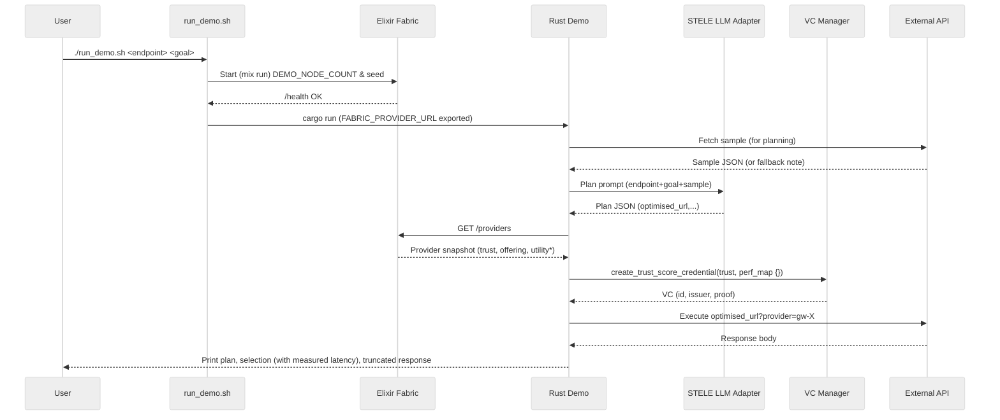

# Flow + Fabric Demo

Primary usage: a single script launches the fabric and runs the Rust flow demo end‑to‑end.

## Architecture Sequence



\*utility currently placeholder (see limitations)

## Current Limitations & Mocked / Simplified Elements

| Area                                           | Current State                                                          | Planned Improvement                                                            |
| ---------------------------------------------- | ---------------------------------------------------------------------- | ------------------------------------------------------------------------------ |
| Economic offering (price_per_call, collateral) | Often 0 due to fallback / demo params; utility returns 0.0             | Implement realistic NIF pricing curve & ensure non-zero values (Backlog P0 #6) |
| Utility selection metric                       | Placeholder; selection may degenerate to first provider when all equal | Real utility from economic + trust + latency inputs                            |
| Latency metrics (/metrics latency_ma)          | Hardcoded placeholder 100.0                                            | Persist moving average per provider (Backlog P1 #3)                            |
| Performance ledger (perf_map in VC)            | Empty map {}                                                           | Introduce counters Agent; populate success/failure rates (Backlog P1 #6)       |
| /simulate endpoint                             | Stub only                                                              | Generate packet DAG + analyse_dag report (Backlog P1 #1)                       |
| Streaming trust updates                        | Not implemented                                                        | SSE/WebSocket broadcast drift ticks (Backlog P1 #2)                            |
| Topology modes                                 | Ring only                                                              | Add mesh / k-nearest selectable (Backlog P1 #5)                                |
| Deterministic seed test                        | Seed implemented & exposed, no test yet                                | Add integration test asserting first N trust scores (P0 #5)                    |
| Error handling wrapper                         | CoreWrapper adopted for main paths; potential residual direct calls    | Complete refactor (P0 #2)                                                      |
| Latency feedback into selection scoring        | Only captured after call, not influencing utility                      | Incorporate historical latency into utility & MA                               |
| Persistence / durability                       | In-memory only (ETS/GenServer state)                                   | Optional persistent store (P2)                                                 |
| Security / auth on fabric endpoints            | Open unauthenticated HTTP                                              | Add JWT / key-based auth & rate limiting (P2)                                  |
| Logging / tracing                              | Basic Logger & tracing info lines                                      | Structured JSON + OpenTelemetry spans (P2)                                     |
| VC issuance in Elixir                          | Not exposed via HTTP                                                   | Add POST /vc/{node_id} (Backlog P1 #4)                                         |

Notes:

- Zero economic values are intentional placeholders; enables structure demonstration without tuning economics yet.
- Utility=0 across providers still exercises VC issuance & selection logging path.
- Deterministic RNG ensures trust drift reproducibility when FABRIC_SEED fixed.

## Quick Start (Recommended Script)

```bash
./run_demo.sh "https://dummyjson.com/products/1" "fetch product and summarise" 3
```

Arguments:

1. endpoint (required)
2. goal (required)
3. node_count (optional, default 3)
   4+. flags: --direct (skip fabric selection), --nifs (enable native NIFs)

Examples:

```bash
# Full flow + fabric economic selection
./run_demo.sh "https://dummyjson.com/products/1" "fetch product and summarise" 5

# Direct mode (bypass fabric selection, still starts fabric for parity)
./run_demo.sh "https://dummyjson.com/products/1" "fetch product and summarise" 3 --direct

# Enable native NIFs (if previously built)
./run_demo.sh "https://dummyjson.com/products/1" "fetch product and summarise" 4 --nifs

# Combine NIFs + direct
./run_demo.sh "https://dummyjson.com/products/1" "fetch product and summarise" 2 --nifs --direct
```

Script behaviour:

- Auto-finds a free port 4000–4010
- Exports FABRIC_PROVIDER_URL for the Rust binary
- Waits for /health before running the demo
- Cleans up the fabric process on exit (INT/TERM)

Verified runs (latest):

- Fabric + selection: OK (port auto-chosen, provider selected, latency captured)
- Direct mode: OK

## What the Demo Does

- Plans an API call via STELE unified LLM adapter
- Queries the fabric for providers (trust/economics)
- Selects the highest utility provider (utility currently 0.0 placeholder until offering pricing NIF path returns >0)
- Issues a trust score Verifiable Credential
- Executes the optimised API call (latency measured & reported)

---

## Manual Operation (If You Prefer Separate Shells)

1. Start fabric (choose one method):

```bash
cd bin/gtr-fabric
PORT=4003 FABRIC_SEED=seed123 DEMO_NODE_COUNT=3 ENABLE_NIFS=1 mix run --no-halt
```

(Or use nohup / noshell / /dev/null redirection variants listed below.)

2. In another terminal run the Rust demo:

```bash
cd bin/demos/flow-fabric-demo
FABRIC_PROVIDER_URL=http://localhost:4003/providers \
  cargo run -- \
    --endpoint "https://dummyjson.com/products/1" \
    --goal "fetch product and summarise"
```

3. Direct mode (no selection):

```bash
cargo run -- --endpoint "https://dummyjson.com/products/1" --goal "fetch product and summarise" --direct
```

4. Inspect fabric state:

```bash
curl -s http://localhost:4003/providers | jq .
curl -s http://localhost:4003/metrics  | jq .
```

Stop fabric (foreground): Ctrl+C

Detached options (examples):

```bash
nohup mix run --no-halt > /tmp/fabric.log 2>&1 &
elixir --erl "-noshell" -S mix run --no-halt > /tmp/fabric.log 2>&1 &
mix run --no-halt </dev/null >/tmp/fabric.log 2>&1 &
```

---

## Starting the Fabric (Detail)

(Previously at top; retained for reference.)

Pick one method (avoid suspensions from backgrounding without detaching TTY):

Foreground (simple; use separate terminal for the Rust demo):

```bash
cd bin/gtr-fabric
PORT=4000 FABRIC_SEED=seed123 DEMO_NODE_COUNT=3 ENABLE_NIFS=1 mix run --no-halt
```

Detached (redirect stdio):

```bash
cd bin/gtr-fabric
PORT=4000 FABRIC_SEED=seed123 DEMO_NODE_COUNT=3 ENABLE_NIFS=1 \
nohup mix run --no-halt > /tmp/fabric.log 2>&1 &
```

Explicit noshell (no interactive drivers):

```bash
cd bin/gtr-fabric
PORT=4000 FABRIC_SEED=seed123 DEMO_NODE_COUNT=3 ENABLE_NIFS=1 \
elixir --erl "-noshell" -S mix run --no-halt > /tmp/fabric.log 2>&1 &
```

/dev/null redirection (quick detach):

```bash
cd bin/gtr-fabric
PORT=4000 FABRIC_SEED=seed123 DEMO_NODE_COUNT=3 ENABLE_NIFS=1 \
mix run --no-halt </dev/null >/tmp/fabric.log 2>&1 &
```

Verify:

```bash
sleep 2
curl -s http://localhost:4000/providers | jq .
curl -s http://localhost:4000/metrics | jq .
```

Stop (if detached):

```bash
pkill -f 'mix run --no-halt'
```

## New Fabric Runtime Features

The bundled lightweight Elixir fabric now provides:

- Deterministic RNG seeding via `FABRIC_SEED` (exposed in `/metrics`)
- Dynamic trust drift (updates every 5s)
- Ring topology exposure at `GET /topology`
- Provider + metrics snapshot at `GET /providers` and `GET /metrics`
- Health check at `GET /health`
- Hot refresh of demo nodes via `POST /refresh` body: `{ "count": <n> }`

## Manual Steps (Alternative)

1. Start fabric (no NIFs):
   ```bash
   cd bin/gtr-fabric
   DEMO_NODE_COUNT=4 ENABLE_NIFS=0 elixir -S mix run --no-halt
   ```
2. In another shell run demo:
   ```bash
   cd bin/demos/flow-fabric-demo
   FABRIC_PROVIDER_URL=http://localhost:4000/providers \
     cargo run -- \
       --endpoint "https://dummyjson.com/products/1" \
       --goal "fetch product and summarise"
   ```

## Refresh / Scale During Runtime

```bash
curl -X POST http://localhost:4000/refresh -d '{"count":6}' -H 'content-type: application/json'
```

Also re-ring-topologises nodes after refresh; trust drift resumes automatically.

## Metrics Example

```bash
curl -s http://localhost:4000/metrics | jq .
```

## Topology Example

```bash
curl -s http://localhost:4000/topology
```

## Endpoints Summary

| Endpoint          | Description                                 |
| ----------------- | ------------------------------------------- |
| `/health`         | Liveness probe                              |
| `/providers`      | Current providers + trust scores (drifting) |
| `/topology`       | Ring topology neighbours                    |
| `/metrics`        | Providers with neighbours + throughput      |
| `/refresh` (POST) | Recreate demo nodes: `{ "count": N }`       |

## Environment Variables

| Variable              | Purpose                                           | Default                           |
| --------------------- | ------------------------------------------------- | --------------------------------- |
| `DEMO_NODE_COUNT`     | Initial node count at startup                     | 2 (script overrides)              |
| `FABRIC_PORT`         | Force fabric port (script auto-searches if unset) | 4000                              |
| `FABRIC_PROVIDER_URL` | Providers endpoint URL for Rust demo              | http://localhost:<port>/providers |
| `FABRIC_SEED`         | Deterministic seed for trust drift                | random per BEAM if unset          |
| `ENABLE_NIFS`         | Build Rust NIFs (1) or skip (0)                   | 0 in script                       |

## Re-enabling Native NIFs

Set `ENABLE_NIFS=1` before compiling the fabric. Ensure Rust deps build cleanly; leave disabled for fastest iteration.
