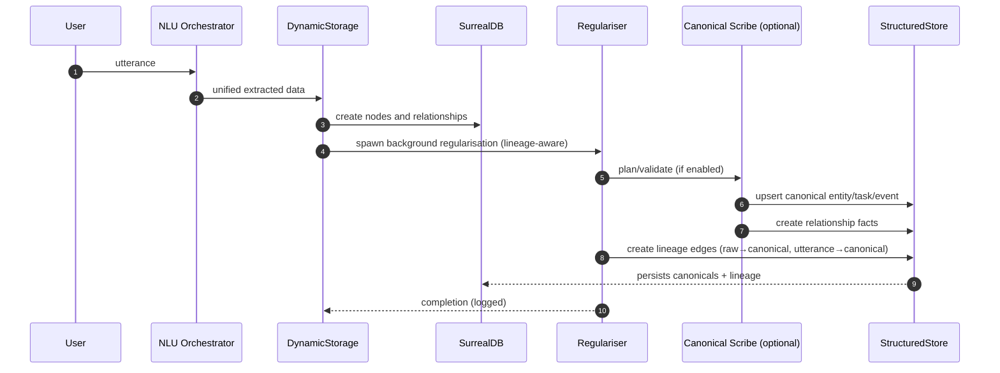
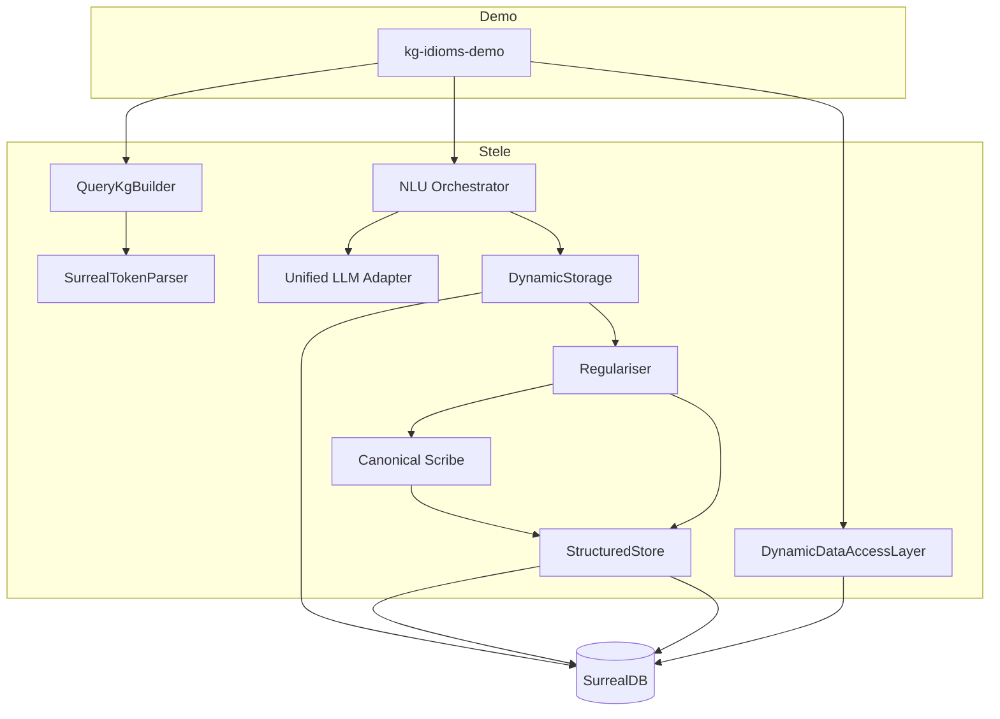

## KG + Idioms + Canonical Scribes Demo

This demo walks through the full loop:

- Build a Query Knowledge Graph (KG) from in-repo docs and report coverage.
- Parse Surreal idioms with KG hints for better routing.
- Ingest an utterance via NLU, persist nodes/edges, and regularise into canonical tables.
- Optionally apply a scribe-driven canonical plan with partial-apply and verify-retry backoff.
- Run a few idiom-first queries over the demo data.

Outputs you’ll see:

- KG coverage summary and a saved `parsing_analysis.json`.
- NLU extraction, plan sizes, and canonical upserts (entities/tasks/events + facts).
- Optional RL metrics log when enabled (attempted/applied/backoffs and a shaped reward).

### Quick one-shot run (fresh dynamic + canonical namespaces)

Ensure SurrealDB is running (see Prerequisites below), then run:

```sh
SURREALDB_URL=ws://127.0.0.1:8000 \
SURREALDB_USER=root \
SURREALDB_PASS=root \
SURREALDB_NS=demo_dyn \
SURREALDB_DB=demo_dyn \
STELE_ENABLE_SCRIBE=1 \
STELE_BP_OVERRIDE=green \
STELE_CANON_URL=ws://127.0.0.1:8000 \
STELE_CANON_USER=root \
STELE_CANON_PASS=root \
STELE_CANON_NS=demo_can \
STELE_CANON_DB=demo_can \
cargo run -p kg-idioms-demo --release
```

This sets up distinct dynamic and canonical namespaces so the regulariser + scribe path can apply and emit provenance events.

## Prerequisites

- Rust toolchain (stable).
- SurrealDB (WebSocket) running locally.
  - Example:
    ```sh
    surreal start --log trace --user root --pass root --bind 127.0.0.1:8000 memory
    ```
- Environment for DB (dynamic graph namespace):
  ```sh
  export SURREALDB_URL=ws://127.0.0.1:8000
  export SURREALDB_USER=root
  export SURREALDB_PASS=root
  export SURREALDB_NS=thinking_dynamic
  export SURREALDB_DB=system
  ```
  Canonical namespace (optional, defaults to dynamic when unset):
  ```sh
  export STELE_CANON_URL=ws://127.0.0.1:8000     # optional; defaults to SURREALDB_URL
  export STELE_CANON_USER=root                   # optional; defaults to SURREALDB_USER
  export STELE_CANON_PASS=root                   # optional; defaults to SURREALDB_PASS
  export STELE_CANON_NS=thinking_canonical       # recommended: separate namespace
  export STELE_CANON_DB=system                   # optional; defaults to SURREALDB_DB
  ```
  Notes:
  - If STELE*CANON*\_ vars equal SURREALDB\_\_ (same ns/db), lineage relations from raw→canonical are created.
  - If they differ (separate namespaces), canonical rows are created in the canonical ns, and lineage edges are skipped (cross-namespace).
- Optional LLMs:
  - The demo uses the unified adapter and will connect to local Ollama if available.
  - Cloud keys (OpenAI/Anthropic) are optional; absence won’t break the demo.

## Quick start

Run the demo (heuristic path only):

```sh
cargo run -q -p kg-idioms-demo
```

Enable the scribe planner/interpreter path:

```sh
STELE_ENABLE_SCRIBE=1 cargo run -q -p kg-idioms-demo
```

Also log RL-shaped apply metrics (demo-only):

```sh
STELE_ENABLE_SCRIBE=1 STELE_DEMO_RL=1 cargo run -q -p kg-idioms-demo
```

Tuning thresholds (optional):

```sh
export STELE_MIN_ITEM_CONFIDENCE=0.5
export STELE_MIN_PLAN_CONFIDENCE=0.5
```

## What the demo does

1. Connects to SurrealDB and seeds a few graph nodes/edges for traversal examples.
2. Builds a Query KG from `crates/stele/src/database/instructions` (falls back to `config/instructions`) and prints:
   - Parser coverage, idiom coverage, and common parse error patterns.
   - Persists a summary to `parsing_analysis.json`.
3. Initialises the NLU orchestrator and unified LLM adapter.
4. Ingests a sample statement:
   - Stores raw nodes and relationships.
   - Background regulariser runs:
     - If `STELE_ENABLE_SCRIBE=1`, produces a canonical plan and applies it with partial-apply semantics.
     - Otherwise, uses a heuristic mapping path.
   - If dynamic and canonical share the same namespace, creates lineage links from raw nodes/utterance to canonical entities; otherwise lineage links are skipped.
5. Prints a canonical snapshot (entities list, quick traversal), then runs idiom-first queries.

## Mermaid diagrams

Sequence (ingest → canonical):



Architecture (major modules):



## Flags and behavior

- STELE_ENABLE_SCRIBE=1
  - Enables planner+interpreter path. Plan sizes and apply results are logged.
  - Partial-apply: failures on individual items are warned and skipped; others proceed.
- Verify/backoff
  - Canonical entity upsert performs create → verify → short backoff → verify, reducing read-after-write misses.
- STELE_DEMO_RL=1 (optional)
  - Records attempted/applied/backoff counts into a shaped reward via a lightweight Q-learning hook and logs it.

## Advanced flags

- STELE_POLICY_SHADOW=1 (optional)

  - Keeps validation in shadow (advise-only). You should see a log like:
    - Shadow policy: plan valid (advise-only)
  - No enforcement—scribe apply still proceeds when enabled.

- STELE_BP_OVERRIDE=red|amber|green (optional)

  - Forces the backpressure level for testing. For red, the scribe apply is skipped and the system falls back to the heuristic path. Example log:
    - Backpressure=Red: skipping scribe apply and falling back
  - A provenance event is recorded with kind `scribe_apply_skipped_backpressure` and linked to the originating utterance.

- Provenance + RL logs
  - On successful scribe apply, a provenance event `scribe_apply_success` is recorded with simple counters. With `STELE_DEMO_RL=1`, you will also see a log like `RL demo: recorded apply outcome ...`.

These flags are optional and intended for smoke-testing the new hooks end-to-end.

## Troubleshooting

- DB connect errors: verify Surreal is running and env vars match your endpoint.
- No KG docs found: the demo falls back to `config/instructions`; coverage may be lower.
- Scribe plan apply aborts: partial-apply keeps the demo running; check logs for confidence thresholds or unique key conflicts.
- No canonical rows immediately: the regulariser is spawned in background—give it ~300–500ms; the demo retries once when summarising.
- Lineage links missing: expected when using separate namespaces (STELE_CANON_NS != SURREALDB_NS). This is by design to avoid cross-namespace RELATE.

## Paths and artifacts

- Docs for KG: `crates/stele/src/database/instructions/` (preferred)
- Parsing analysis: `parsing_analysis.json` in repo root
- Canonical tables (in canonical namespace when configured): `canonical_entity`, `canonical_task`, `canonical_event`, `canonical_relationship_fact`

NOTES
See provenance events for the current utterance (enable scribe to emit them):
STELE_ENABLE_SCRIBE=1 cargo run -q -p kg-idioms-demo
Exercise backpressure metrics logging:
STELE_BP_METRICS_LOG=1 cargo run -q -p kg-idioms-demo
Force a red backpressure skip to guarantee a provenance event:
STELE_ENABLE_SCRIBE=1 STELE_BP_OVERRIDE=red cargo run -q -p kg-idioms-demo
Notes
