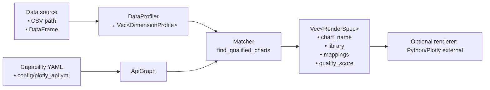
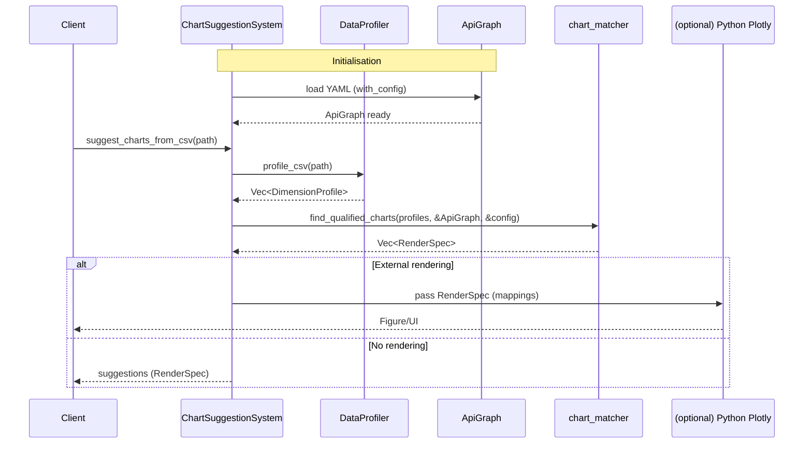

# Estel: Multi‑Modal Data Intelligence Engine

Estel is a multi‑modal intelligence engine. The current public module delivers intelligent data visualisation recommendations using statistical profiling, a declarative capability graph, and a multi‑stage matcher — without requiring ML training data. The architecture is modular to accommodate additional modalities over time.

Key points:

- Public, supported API focuses on profiling and visualisation suggestion
- High‑performance columnar profiling via Polars + Rayon
- Declarative visualisation capability catalogue defined in `plotly_api.yml`
- Optional, feature‑gated symbolic filtering and intent modules (not enabled by default); designed to assist AI/multi‑modal agents with visual search and pattern recognition over large datasets

## What works today

- Data profiling from CSV or an in‑memory DataFrame
- Chart capability graph: loads YAML describing chart types, args and tags
- Multi‑stage matcher producing ranked `RenderSpec` suggestions
- Ready‑to‑use high‑level façade: `ChartSuggestionSystem`

## Core architecture (today)



## Suggestion sequence (today)



## Quick start

Use the high‑level façade for the simplest path.

```rust
use estel::{ChartSuggestionSystem, MatchingConfig, ProfilingConfig, Result};

fn main() -> Result<()> {
    // Prefer an explicit config path when using this as a library
    let system = ChartSuggestionSystem::with_config(
        "config/plotly_api.yml",
        ProfilingConfig::default(),
        MatchingConfig::default(),
    )?;

    let suggestions = system.suggest_charts_from_csv("./examples/sales.csv")?;
    for s in suggestions {
        println!("{}:{} quality={:.2} mappings={:?}", s.library, s.chart_name, s.quality_score, s.mappings);
    }
    Ok(())
}
```

Alternative: compose the building blocks manually.

```rust
use estel::{ApiGraph, DataProfiler, MatchingConfig, Result};

fn main() -> Result<()> {
    let profiles = DataProfiler::new().profile_csv("./examples/sales.csv")?;
    let api_graph = ApiGraph::from_yaml_file("config/plotly_api.yml")?;

    let specs = estel::chart_matcher::find_qualified_charts(
        &profiles,
        &api_graph,
        &MatchingConfig::default(),
    );

    for s in specs {
        println!("{} ({:.2}) -> {:?}", s.chart_name, s.quality_score, s.mappings);
    }
    Ok(())
}
```

Notes

- `ChartSuggestionSystem::new()` expects `config/plotly_api.yml` to be present at runtime. In library use, prefer `with_config(...)` with an explicit path.
- `Result` is re‑exported from `estel::error`.

## RenderSpec (output)

Each suggestion includes:

- chart_name, library, description
- mappings: field name → column name
- quality_score and optional per‑dimension scores
- dimensions_used and completeness

These can be adapted to your renderer of choice. A Python Plotly renderer exists under `python_helpers/` for experimentation.

## YAML chart capability graph

The file `config/plotly_api.yml` declares chart types, semantic tags and argument specifications (required/optional, accepted data types). `ApiGraph` loads this and powers feasibility checks and semantic scoring.

## Performance characteristics

- Polars DataFrame operations for profiling
- Rayon parallelism for per‑column work and scoring
- Configurable thresholds to trade exploration breadth vs. performance

## AI and multi‑modal positioning

Estel is designed to assist AI/multi‑modal systems to ingest and explore large datasets via visual search and pattern recognition:

- Reduces search space: profiles columns and uses a capability graph to propose feasible visual encodings
- Supplies interpretable hints: optional symbolic filtering yields a score and human‑readable notes agents can consume
- Encourages fast iteration: lightweight, local‑first pipeline with optional external rendering

The demo (`bin/demos/estel-chart-demo`) shows how symbolic feedback can be surfaced alongside suggestions.

## Experimental modules (subject to change)

These modules are present in the repository but are not part of the public API surface. They are evolving and may change substantially.

- intent (`src/intent/`)
  - LLM‑style API and an intent processor to chain transformations and chart suggestions
  - Current code uses internal types and paths; not exported via `lib.rs`
- data_handler (`src/data_handler/`)
  - Columnar storage, streaming CSV ingest, transformation engine
  - Used by intent experiments; not exported via `lib.rs`
- symbolic_filtering (`src/symbolic_filtering/`)
  - Neuro‑symbolic scoring research (feature extractors + symbolic rules, with an optional graph‑aware adaptor)
  - Designed to provide agent‑readable justification notes to guide visual search and ranking
  - Feature‑gated (off by default)

If you need these today, treat them as internal and expect breaking changes.

## Roadmap (high‑level)

- Public, stabilised façade for intent‑driven workflows
- Optional integration of symbolic filtering into the main scoring pipeline
- First‑class rendering adapters (e.g., Plotly, Vega‑Lite) with tested mappings
- Persisted chart catalogues and domain profiles
- Extended profiling: time‑series frequency inference, anomaly hints
- Agent‑facing APIs for multi‑modal search and explanation surfaces

## Optional learnable scoring head (experimental)

A lightweight re‑ranking head that blends existing heuristic scores with dataset context and optional symbolic scores. Train offline (e.g., logistic regression/GBM) to obtain weights; at runtime we use a fast weighted sum in Rust.

- Enable feature: `learned-scorer`
- Types: `LearnedScorer`, `LearnedDatasetStats`, `LearnedFeatureVector`
- Usage (library):

```rust
use estel::{ChartSuggestionSystem, MatchingConfig, ProfilingConfig};
#[cfg(feature = "learned-scorer")]
use estel::LearnedScorer;

fn main() -> estel::Result<()> {
    let system = ChartSuggestionSystem::with_config(
        "config/plotly_api.yml",
        ProfilingConfig::default(),
        MatchingConfig::default(),
    )?;

    #[cfg(feature = "learned-scorer")]
    {
        let scorer = LearnedScorer::default_head();
        let reranked = system.suggest_charts_reranked_from_csv(
            "./examples/sales.csv",
            &scorer,
            /* optional symbolic scores */ None,
        )?;
        for (spec, score) in reranked.into_iter().take(5) {
            println!("[learned {:.2}] {} -> {:?}", score, spec.chart_name, spec.mappings);
        }
    }
    Ok(())
}
```

Notes

- Start with `default_head()` and iterate weights as you gather clicks or top‑N feedback.
- You can pass a `HashMap<String, f64>` of per‑chart symbolic scores to blend symbolic reasoning into the ranking.

## Licence

AGPL‑3.0‑only. See `LICENSE`.
