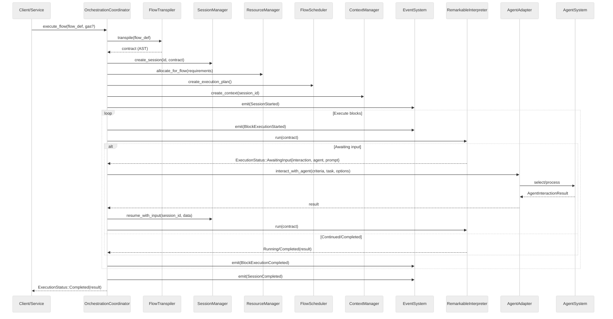

# Sleet: Multi‑Agent Orchestration and Bytecode Runtime

Sleet is a Rust crate for building AI‑assisted workflows. It combines:

- A declarative flow model with a transpiler to an execution contract
- A gas‑metered runtime with a small bytecode VM
- A multi‑agent orchestration layer with adapters for agents, LLMs, tasks and workflows

The result is a cohesive system for long‑running, resumable processes with human/agent‑in‑the‑loop interactions.

## Features

- Declarative Flow → Contract transpilation (with expression compilation)
- Orchestration coordinator with resource, session and event management
- Agent system with capability matching and team generation
- LLM processing via a unified adapter layer
- Task orchestration (competition/consensus patterns)
- Async pause/resume with Await semantics
- FFI for safe integration with external systems

## Crate layout

- `agents/` — agent generation, registry and capability matching
- `ast.rs` — unified AST used by the runtime
- `flows.rs` — flow definition types (Conditional, Compute, AwaitInput, ForEach, TryCatch, …)
- `llm/` — LLM processor, prompts, validation and unified adapter
- `orchestration/` — coordinator, adapters, resource/session/context managers
- `runtime/` — VM, interpreter, assembler, profiler
- `tasks/` — task analysis, task system and flow loading
- `transpiler.rs` — FlowDefinition → orchestration contract (with expression compiler)

The root `lib.rs` re‑exports public types and provides helper entry points.

## How it fits together (wiring)

There are two complementary execution paths:

1. Direct flow execution

- You define a `FlowDefinition`
- `FlowTranspiler` converts it into an orchestration contract (AST)
- The contract is converted into the unified runtime AST
- `RemarkableInterpreter` executes with gas limits and returns `ExecutionStatus`

2. Orchestrated flow execution

- You run via `OrchestrationCoordinator`, which manages sessions, scheduling, resources and adapters
- Blocks like AgentInteraction, LLMProcessing, TaskExecution, ParallelExecution are handled by adapters
- Await points yield `ExecutionStatus::AwaitingInput`, and you resume later

Key orchestration subsystems

- `ResourceManager` — pools and allocates agents/LLM/tasks/workflows
- `SessionManager` — session state, progress, final results
- `ContextManager` — variables and transient input data
- `FlowScheduler` — plans/limits concurrent block execution
- `EventSystem` — emits lifecycle events (started, block completed, errors)
- Adapters — `AgentAdapter`, `LLMAdapter`, `TaskAdapter`, `WorkflowAdapter`

## Quick start

### Direct flow execution

```rust
use sleet::{execute_flow, flows::definition::*};

let mut flow = FlowDefinition::new("demo", "start");

flow
  .add_block(BlockDefinition::new("start", BlockType::Compute {
      expression: "\"hello\"".to_string(),
      output_key: "greeting".to_string(),
      next_block: "await_user".to_string(),
  }))
  .add_block(BlockDefinition::new("await_user", BlockType::AwaitInput {
      interaction_id: "user_input".to_string(),
      agent_id: "human".to_string(),
      prompt: "\"Please provide input\"".to_string(),
      state_key: "user_text".to_string(),
      next_block: "done".to_string(),
  }))
  .add_block(BlockDefinition::new("done", BlockType::Terminate));

let status = execute_flow(flow, 10_000, None).await?;
match status {
    sleet::runtime::ExecutionStatus::AwaitingInput { interaction_id, .. } => {
        // Persist session and collect user/agent input, then resume via your own logic
        println!("Awaiting input for {interaction_id}");
    }
    sleet::runtime::ExecutionStatus::Completed(result) => {
        println!("Completed with result: {result}");
    }
    _ => {}
}
# Ok::<(), Box<dyn std::error::Error>>(())
```

Notes

- `Compute.expression` accepts simple literals and expressions; `output_key` writes into `state.output_key`.
- `AwaitInput.prompt` is compiled; use a quoted string for a static prompt as above.

### Orchestrated execution (coordinator)

You can run the same flow under orchestration. Any `FlowDefinition` converts into an `OrchestrationFlowDefinition` via `Into`:

```rust
use sleet::{create_orchestration_coordinator, OrchestrationConfig, flows::definition::*};

let flow: FlowDefinition = /* build as above */ FlowDefinition::new("demo", "start");
let mut coord = create_orchestration_coordinator(
    OrchestrationConfig::default(),
    None, // Optional AgentSystem
    None, // Optional LLMProcessor
    None, // Optional TaskSystem
).await?;

let status = coord.execute_flow(flow.into(), None).await?; // optional gas limit
```

Coordinator tips

- Use `initialise(agent_system, llm_processor, task_system)` if you manage these subsystems externally
- `resume_session(session_id, input_data)` continues an awaiting session
- `get_session_status(session_id)` reports progress and resource usage

## Public API highlights

- Helper entry points

  - `execute_flow(flow_def: FlowDefinition, initial_gas: u64, ffi: Option<FfiRegistry>) -> Result<ExecutionStatus, _>`
  - `execute_orchestrated_flow(flow_def: OrchestrationFlowDefinition, gas: Option<u64>, cfg: Option<OrchestrationConfig>) -> OrchestrationResult<ExecutionStatus>`
  - `create_orchestration_coordinator(cfg: OrchestrationConfig, agent: Option<AgentSystem>, llm: Option<LLMProcessor>, task: Option<TaskSystem>) -> OrchestrationResult<OrchestrationCoordinator>`

- Coordinator essentials (see `orchestration/coordinator.rs`)

  - `OrchestrationCoordinator::new(cfg) -> OrchestrationResult<Self>`
  - `execute_flow(OrchestrationFlowDefinition, Option<u64>) -> OrchestrationResult<ExecutionStatus>`
  - `resume_session(session_id, input: serde_json::Value) -> OrchestrationResult<ExecutionStatus>`
  - `get_session_status(session_id) -> OrchestrationResult<SessionStatus>`

- Runtime
  - `RemarkableInterpreter::new(gas, &contract, ffi) -> anyhow::Result<Self>`
  - `run(contract) -> anyhow::Result<ExecutionStatus>`
  - `ExecutionStatus::{Running, AwaitingInput { .. }, Completed(Value)}`

## Bytecode VM and expressions

- 29 opcodes for stack operations, arithmetic/logic, control flow and FFI
- Expressions in `Compute`/`Conditional` are tokenised → parsed → validated (against optional state schema) → compiled to bytecode
- Paths for state updates use dot notation and support dynamic offsets

## Orchestration‑only blocks

Beyond the standard `flows::definition::BlockType`, the orchestration layer adds richer blocks handled by adapters:

- `AgentInteraction` — capability‑based selection and interaction
- `LLMProcessing` — prompt templating and response processing
- `TaskExecution` — execute a task with resources and strategy
- `WorkflowInvocation` — call a sub‑workflow with mappings
- `ParallelExecution` — run branches and merge results
- Control blocks — `ForEach`, `Continue`, `Break`, `TryCatch`, `StateCheckpoint`, `EventTrigger`, etc.

When running under the coordinator these are executed with resource accounting and events.

## Notes on behaviour and limits

- Flow validation checks references and basic limits; orchestration adds resource limit checks per session
- Await semantics are explicit; you decide how to store session state and when to resume
- FFI functions operate on `runtime::Value` with helpers for ergonomic JSON

## Roadmap (high‑level)

- Full interpreter coverage for richer AST evaluation paths and tighter VM integration
- Persistence layer for sessions/checkpoints with pluggable backends
- Additional adapters (tools, data stores) and richer agent selection strategies
- More robust static analysis for flows (dead‑path detection, effect typing)
- Performance work: JIT improvements, profiling, and scheduling heuristics
- Built‑in observability: tracing spans and metrics export

## Architecture diagrams

### System architecture (high‑level)

```mermaid
graph TB
  %% Clients and inputs
  U[Client / Service] -->|execute_flow / resume_session| C(Coordinator)
  FD[FlowDefinition] --> T(FlowTranspiler)
  T -->|Contract (AST)| C

  subgraph Orchestration Layer
    C[OrchestrationCoordinator]
    SM[SessionManager]
    RM[ResourceManager]
    FS[FlowScheduler]
    CM[ContextManager]
    EV[EventSystem]
  end

  C --- SM
  C --- RM
  C --- FS
  C --- CM
  C --- EV

  subgraph Adapters
    AA[AgentAdapter]
    LA[LLMAdapter]
    TA[TaskAdapter]
    WA[WorkflowAdapter]
  end

  C --> AA
  C --> LA
  C --> TA
  C --> WA

  subgraph Core Engine
    RI[RemarkableInterpreter]
    VM[Bytecode VM]
    FFI[FFI Registry]
  end

  C --> RI
  RI --> VM
  RI --> FFI

  RI -. ExecutionStatus::AwaitingInput .-> C
  C  -. resume_session(input) .-> RI

  subgraph External Systems
    AS[AgentSystem]
    LP[LLMProcessor]
    TS[TaskSystem]
  end

  AA --> AS
  LA --> LP
  TA --> TS
```

### Orchestrated execution sequence



—
Copyright (C) 2024 Jonathan Lee. Licensed under AGPL‑3.0‑only.
