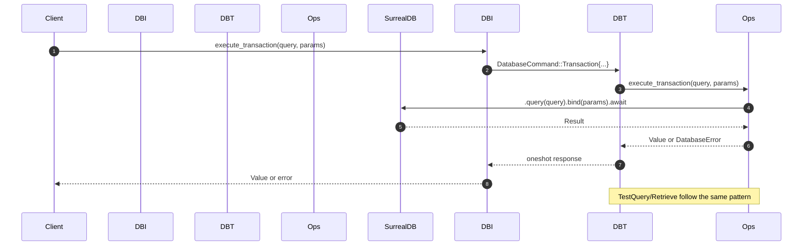
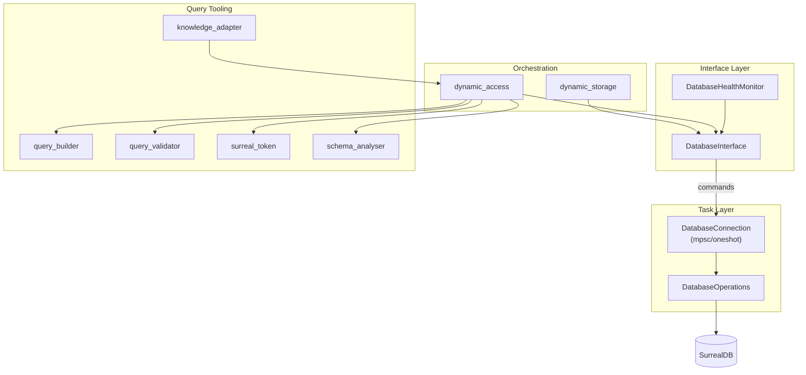
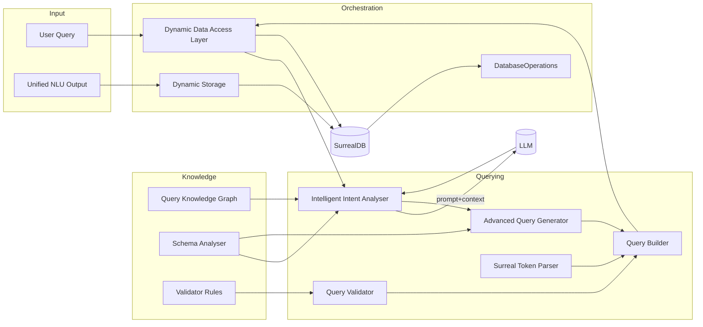

# Stele Database Module

This module provides an opinionated, async wrapper around SurrealDB for storing and querying NLU outputs and knowledge-graph data. It includes connection lifecycle management, schema bootstrapping, safe query construction/validation, health monitoring, and higher-level orchestration for intent-driven queries.

## Highlights

- Async message-passing interface (mpsc/oneshot) between the API surface and the DB task
- Schema bootstrapping on connect (via embedded `config/database_schema.sql`)
- SurrealQL builder and validator (structured Select/Relate builders + token parser)
- Intent-to-query pipeline, leveraging configurable patterns/domains and a knowledge graph
- Health monitoring with graceful shutdown

## Module map

- `connection.rs` — Connects/authenticates, applies schema, exposes health/stats helpers
- `operations.rs` — High-level DB ops (store NLU data, relationships, metrics, stats)
- `types.rs` — Core types: errors, commands, metrics, statuses
- `data_interpreter.rs` — Spawns the DB task and exposes a convenient interface
- `health_monitor.rs` — Periodic health checks with graceful shutdown
- `query_builder.rs` — Typed SurrealQL builders (Select/Relate), functions, operators
- `query_validator.rs` — LLM intent negotiation, rules, and validation
- `surreal_token.rs` & `tokens/` — Tokenisation/parsing of Surreal idioms -> builders
- `schema_analyser.rs` — Analyses DB schema + YAML patterns/domains, defines search fields
- `knowledge_adapter.rs` — Hydrates DB records into `KnowledgeNode`s and back
- `dynamic_access.rs` — End-to-end flow for natural-language queries using the above
- `dynamic_storage.rs` — Writes extracted nodes/edges from NLU pipelines

## Sequence: request → DB



## Architecture for developers



### Detailed dataflow overview



Key notes

- Token parsing (surreal_token) converts idioms to SelectQuery and now benefits from stricter rendering in query_builder.
- query_builder sanitizes identifiers/fields and validates raw conditions to reduce injection risk.
- dynamic_storage persists nodes/edges with lineage links (derived_from, edge_derived_from) and optional regulariser background task to canonicalise facts.
- schema_analyser inspects DB and merges YAML patterns/domains into a GraphSchema that seeds search patterns and intent hints.

## Configuration

Environment variables (dotenv supported):

- `SURREALDB_URL` (preferred) — e.g. `ws://127.0.0.1:8000`
- or `SURREALDB_HOST` + `SURREALDB_PORT`
- `SURREALDB_USER`, `SURREALDB_PASS`, `SURREALDB_NS`, `SURREALDB_DB`

On connect, the module applies the schema from `config/database_schema.sql` (embedded via `include_str!`). Keep that file updated to evolve tables/indexes safely.

Additional configs under `src/database/config`:

- `patterns.yaml`, `domains.yaml` — schema/intent analysis inputs
- `query_rules.yaml` — validator rules

Prompt/config helpers under:

- `src/database/prompts/` and `instructions/`

## Key flows

- Store NLU results: `DatabaseOperations::store_unified_nlu_data`
  - Creates an `utterance` record → stores nodes → relates edges → ties all to utterance
- Query building: `AdvancedQueryGenerator`
  - Uses `GraphSchema` search patterns and intent traversals to create `SelectQuery`
- Query validation: `QueryValidator/Negotiator`
  - Applies rule set from `query_rules.yaml`; can provide revision hints
- Natural-language access: `DynamicDataAccessLayer`
  - LLM-assisted plan → builder/validator → execute → `KnowledgeNodeAdapter` hydrate
- Health + stats
  - `DatabaseInterface::check_database_health` for ping
  - `DatabaseOperations::{health_check,get_comprehensive_stats}` for deeper telemetry

## Backwards compatibility notes

- Metrics/health queries prefer canonical `nodes` (with `type`) and `edges`. If your deployment uses legacy tables (e.g., `entity_nodes`, `action_nodes`, `relationships`), adapt queries or add views/aliases in your schema to maintain compatibility.
- `KnowledgeNodeAdapter` is tolerant of case differences in `type` (e.g., `Entity` vs `entity`).

## Development

- Build the crate:

```bash
cargo check -p stele
```

- Where to add new queries

  - Prefer `query_builder` for composable, safe SurrealQL; add new functions/operators if needed
  - Extend `query_validator` rules for LLM-driven inputs

- Evolving the schema
  - Edit `config/database_schema.sql`, ensure idempotency where possible
  - Keep `schema_analyser` and `node_search_patterns` in sync with new fields

## Extension points

- Add new `KnowledgeNode` variants and update `knowledge_adapter.rs`
- Extend traversal semantics in `query_builder` and `query_generator`
- Enrich `health_monitor` with remedial actions (e.g., reconnect on failure)

## Surreal tokenisation and idiom parsing (critical)

The `surreal_token` subsystem converts Surreal idioms (field paths, graph traversals, array access) into a typed `IdiomToken` and then into a safe `SelectQuery`. It optionally validates inputs through the `QueryNegotiator` before and after parsing.

- Core entry points

  - `SurrealTokenParser::new()` loads prompts from `prompts/surreal_datatypes.yml` (embedded at compile-time) and initialises the parser.
  - `parse_with_validation(&mut self, input: &str) -> Result<IdiomToken, QueryError>` performs pre- and post- structure validation if a negotiator is set (via `with_negotiator`).
  - `convert_idiom_to_select_query(&IdiomToken) -> SelectQuery` transforms idioms into builder queries.

- Key idiom parts handled

  - Fields: `foo.bar` → `IdiomPart::Field("foo")`, `IdiomPart::Field("bar")`
  - Arrays: `arr[0]` → `IdiomPart::Index(0)`; `arr[*]` → wildcard as value-only; backtick form `` arr[`] `` maps to `"$"` sentinel for current scope
  - Graph: `-\>relation` → `IdiomPart::Graph("relation")` with optional `GraphContext` (direction, filters, table types, depth)
  - Optional/current record: `?` and `@` become conditions
  - Recursion: `{N}` after `{` sets `IdiomPart::Recursive(N)`

- Minimal usage example

```rust
use crate::database::surreal_token::SurrealTokenParser;
use crate::database::tokens::IdiomToken;

let mut parser = SurrealTokenParser::new().unwrap();
let idiom: IdiomToken = parser.parse_with_validation("nodes->edge{WHERE type = 'knows'}[0]")?;
let select = SurrealTokenParser::convert_idiom_to_select_query(&idiom);
// select can be rendered/executed via DatabaseOperations
```

Notes

- Token ordering (see `type_ordering_weight`) gives a deterministic priority across token classes when needed.
- Prompts for LLM assistance are loaded from YAML and can be extended without code changes.

## Plan: improve utilisation with the Query KG

`query_kg.rs` builds a Knowledge Graph from Surreal docs, normalises example queries, parses them into AST, and tracks parser coverage. We will wire `surreal_token` into this loop to increase safety and coverage.

Short-term

- Add a KG → Idiom check: for each example pattern, attempt idiom tokenisation via `SurrealTokenParser`, then auto-generate the `SelectQuery` and compare against the AST’s salient properties (tables, filters, traversal direction). Record success/failure alongside the existing `ParsingRegistry`.
- Produce a consolidated report (JSON) with three buckets: native AST parse, idiom tokenisation success, and deltas. Store as `parsing_analysis.json` with new fields.
- Expose a developer command in `DatabaseOperations` to run the KG build + token coverage pass on demand for CI and local triage.

Medium-term

- Use KG-derived operator/specs to enrich `QueryNegotiator` rules so invalid idioms are rejected earlier with actionable hints.
- Feed idiom prompts (from `surreal_datatypes.yml`) into KG-driven examples to improve LLM plans in `dynamic_access` (match the right idiom template, then fill parameters).
- Add round-trip tests: Idiom → SelectQuery → Surreal (execute against a fixture DB) and assert result shape, guarded under a `ci-kv` feature flag.

Longer-term

- Implement a small adapter to map Surreal AST Statements back to `IdiomToken` for explainability and for comparing builder output with native parser semantics.
- Use coverage gaps from KG to prioritise new `IdiomPart` capabilities (e.g., richer function calls, multi-hop constraints), and to extend `query_builder` accordingly.

Integration hooks

- `dynamic_access`: after planning, prefer idiom tokenisation → `SelectQuery`; fall back to AST-based execution for unsupported forms.
- `schema_analyser`: leverage KG table/type hints to pre-fill `GraphContext.table_types` and default filters during idiom parsing.
- `query_validator`: import KG operator constraints to tighten `WHERE` and traversal rules.

## New capabilities (KG + Idioms)

- Structural coverage in KG build
  - During KG construction, each example query is tokenised to an idiom and converted to a SelectQuery; we compute a rough structural comparison against the original query (graph/where/limit/order/count/from tables) and store summaries in parsing_analysis.json.
- Negotiator seeded with KG hints
  - QueryNegotiator::with_kg_hints(&QueryKnowledgeGraph) augments allowed_operators from the docs; SurrealTokenParser::with_kg_hints(&kg) provides a convenience constructor.
- Idiom-first planning path
  - DynamicDataAccessLayer tries a KG-guided idiom path for complex queries before falling back to LLM planning, favouring the builder for safety and observability.

Try it

- Generate KG and write coverage:
  - QueryKgBuilder::new(docs_path).build_and_save_analysis("parsing_analysis.json")
- Parse an idiom with KG hints:
  - let mut parser = SurrealTokenParser::with_kg_hints(&kg);

## Troubleshooting

- Connection errors: verify `SURREALDB_URL` or host/port and credentials; ensure WS transport enabled
- Missing data: confirm schema applied and table names match queries (`nodes`, `edges`, `utterance`, `segment`)
- Validator blocks query: review `config/query_rules.yaml` and adjust `allowed_tables`, `field_types`, `allowed_operators`
